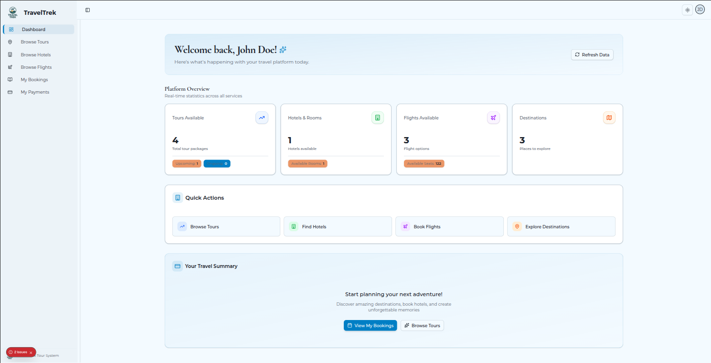
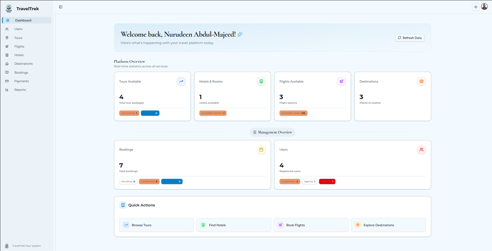
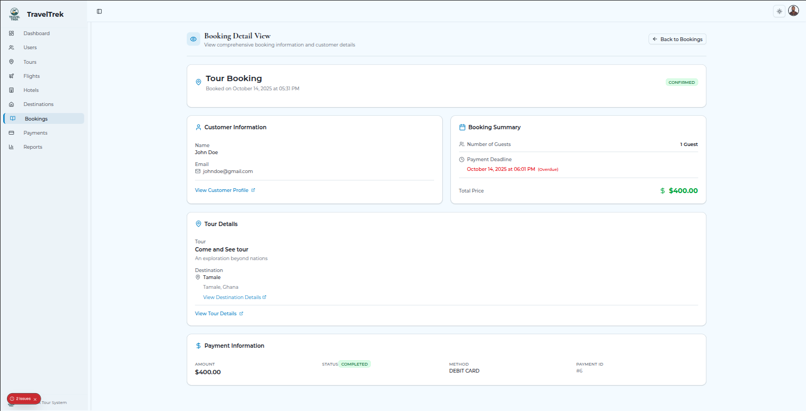

# 🌍 TravelTrek – Smart Travel & Tour Management Platform

**TravelTrek** is an all-in-one travel and tour management system built to streamline the **booking**, **planning**, and **management** of trips and tours.
Users can easily explore destinations, book flights, hotels, and tours — while admins and agents handle operations behind the scenes to ensure a smooth, automated travel experience.

---

## 📚 Table of Contents

* [Features](#-features)
* [Tech Stack](#-tech-stack)
* [Architecture Overview](#-architecture-overview)
* [Screenshots](#-screenshots)
* [Getting Started](#-getting-started)
* [Environment Variables](#-environment-variables)
* [Usage](#-usage)
* [Project Structure](#-project-structure)
* [Deployment](#-deployment)
* [Contributing](#-contributing)
* [License](#-license)
* [Author](#-author)

---

## ✨ Features

### 🧳 User Experience

* Explore available destinations, tours, flights, and hotels.
* Book multiple services in a single itinerary.
* Manage bookings, payments, and travel plans seamlessly.
* Real-time status updates for flights and tours.
* Upload documents and travel proofs securely via **Cloudinary**.

### 🛡️ Admin Capabilities

* Manage all system data including:

  * Flights ✈️
  * Hotels & Rooms 🏨
  * Tours & Destinations 🌐
* Handle bookings and payments for users.
* Oversee agent activities and booking performance.
* Full control of platform operations and content.

### 🤝 Agent Role

* Book flights, hotels, and tours on behalf of users.
* Process payments and manage customer bookings.
* Receive system updates and alerts about availability or schedule changes.

### ⚙️ Automated System Intelligence

* **Redis-powered cron jobs**:

  * Automatically mark overdue unpaid bookings as *unpaid*.
  * Check flight arrival/departure times and auto-update statuses.
* **RabbitMQ integration** for background task handling and notification queues.

### 🔐 Authentication & Security

* Cookie-based **JWT authentication**.
* Protected routes for users, admins, and agents.
* Validation powered by **Zod** (frontend) and **Express Validator** (backend).
* Secure file management via **Cloudinary**.

---

## 🛠️ Tech Stack

| Layer                | Technology                                   |
| -------------------- | -------------------------------------------- |
| **Frontend**         | Next.js (TypeScript), TailwindCSS, shadcn/ui |
| **State Management** | Redux Toolkit                                |
| **Validation**       | Zod (frontend), Express Validator (backend)  |
| **Backend**          | Node.js, Express.js (TypeScript)             |
| **Database**         | PostgreSQL + Prisma ORM                      |
| **Auth**             | JWT + Cookies                                |
| **File Storage**     | Cloudinary                                   |
| **Queue & Jobs**     | Redis, RabbitMQ                              |
| **Deployment**       | Render (Backend), Vercel (Frontend)          |

---

## 🏗️ Architecture Overview

User / Agent / Admin Interface (Next.js + Redux)
↓
REST API (Express.js + TypeScript)
↓
PostgreSQL + Prisma ORM
↓
Redis (Cron Jobs) + RabbitMQ (Queues)

File Storage: Cloudinary

---

## 🖼️ Screenshots

| Section            | Image                                               |
| ------------------ | --------------------------------------------------- |
| User Dashboard     |    |
| Admin Dashboard    |  |
| Booking Management |       |

---

## 🚀 Getting Started

### Prerequisites

* **Node.js** >= 18
* **PostgreSQL** >= 14
* **Redis**
* **RabbitMQ**

### Installation

```bash
# Clone the project
git clone git@github.com:your-username/traveltrek.git
cd traveltrek

# Install dependencies (includes both client & server)
npm install
```

### Database Setup

```bash
# Initialize database with Prisma
npm run migrate
```

> ⚙️ **Seed Default Admin User**
>
> After running the migration, you must seed the database to create the **default admin user**:
>
> ```bash
> npm run seed
> ```
>
> This step ensures the system has an initial admin account available for login and management.

### Running the Application

```bash
# Development mode (both client & server)
npm run dev

# Production mode
npm run build
npm start
```

Default URLs:
👉 [http://localhost:3000](http://localhost:3000) *(Frontend)*
👉 [http://localhost:8080](http://localhost:8080) *(Backend API)*

---

## 🔐 Environment Variables

Create `.env` files for **both** frontend and backend following the provided `env.example` files.
Ensure all API keys, database URLs, Cloudinary credentials, and Redis/RabbitMQ connections are properly configured.

---

## ▶️ Usage

* **Users** browse destinations, book flights, hotels, and tours.
* **Agents** assist users with bookings and payments.
* **Admins** manage the platform’s entire ecosystem.
* **System** runs background tasks (via Redis & RabbitMQ) to auto-update and maintain integrity.

---

## 📦 Project Structure

```
traveltrek/
│
├── client/          # Next.js frontend
│   ├── components/
│   ├── redux/
│   └── app/
│  
├── server/          # Express.js backend
│   ├── prisma/
│   ├── src/
│   └── types/
│    
└── public/docs/     # Screenshots & docs
```

---

## 🌐 Deployment

Live Demo: [https://traveltrek.manuru.dev/](https://traveltrek.manuru.dev/)

Deployed using:

* **Frontend** – Vercel
* **Backend** – Render
* **Database** – Managed PostgreSQL
* **File Storage** – Cloudinary
* **Task Automation** – Redis + RabbitMQ

---

## 🤝 Contributing

Contributions are welcome! If you'd like to improve this project, feel free to:

- **Fork** the repository
- **Create a feature branch** (`git checkout -b feature/amazing-feature`)
- **Commit your changes** (`git commit -m 'Add some amazing feature'`)
- **Push to the branch** (`git push origin feature/amazing-feature`)
- **Open a Pull Request**

Please ensure your code follows the project's style guidelines and includes appropriate tests where applicable.

For major changes, please open an issue first to discuss what you would like to change.

📩 Questions or suggestions?
**[abdulmajeednurudeen47@gmail.com](mailto:abdulmajeednurudeen47@gmail.com)**

---

## 🧾 License

**MIT License**

Copyright (c) 2025 Nurudeen Abdul-Majeed

Permission is hereby granted, free of charge, to any person obtaining a copy
of this software and associated documentation files (the "Software"), to deal
in the Software without restriction, including without limitation the rights
to use, copy, modify, merge, publish, distribute, sublicense, and/or sell
copies of the Software, and to permit persons to whom the Software is
furnished to do so, subject to the following conditions:

The above copyright notice and this permission notice shall be included in all
copies or substantial portions of the Software.

THE SOFTWARE IS PROVIDED "AS IS", WITHOUT WARRANTY OF ANY KIND, EXPRESS OR
IMPLIED, INCLUDING BUT NOT LIMITED TO THE WARRANTIES OF MERCHANTABILITY,
FITNESS FOR A PARTICULAR PURPOSE AND NONINFRINGEMENT. IN NO EVENT SHALL THE
AUTHORS OR COPYRIGHT HOLDERS BE LIABLE FOR ANY CLAIM, DAMAGES OR OTHER
LIABILITY, WHETHER IN AN ACTION OF CONTRACT, TORT OR OTHERWISE, ARISING FROM,
OUT OF OR IN CONNECTION WITH THE SOFTWARE OR THE USE OR OTHER DEALINGS IN THE
SOFTWARE.

---

## 🧠 Author

* Developer: **Nurudeen Abdul-Majeed**
* Email: **[abdulmajeednurudeen47@gmail.com](mailto:abdulmajeednurudeen47@gmail.com)**

